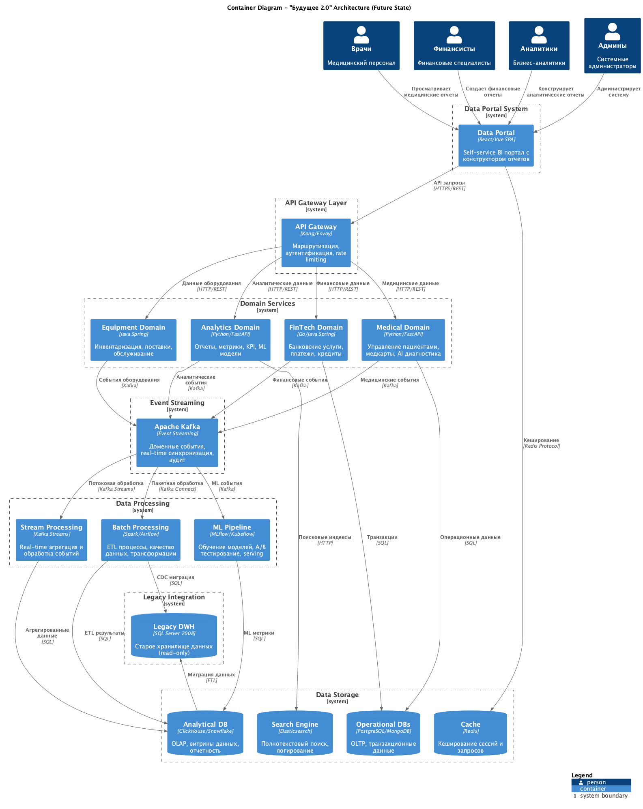
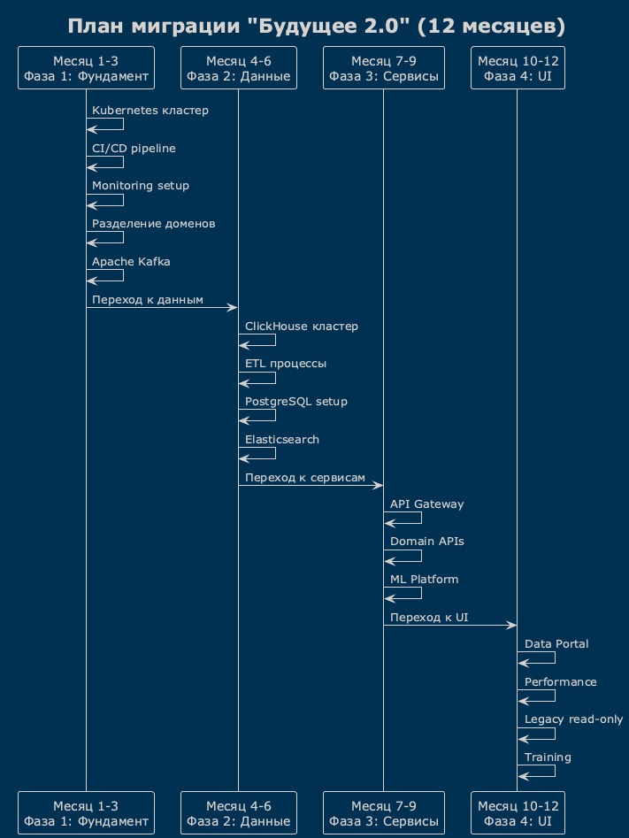

# Архитектура системы через год

## C4 Диаграмма контейнеров

### UML-диаграмма архитектуры системы

**Исходный код диаграммы:** [C4_Container_Diagram.puml](uml/C4_Container_Diagram.puml)

### Описание архитектуры

Новая архитектура построена на принципах Domain-Driven Design и включает следующие слои:

#### Пользователи
- **Врачи** - работают с медицинскими данными и отчетами
- **Финансисты** - управляют финансовыми операциями и отчетностью  
- **Аналитики** - создают аналитические отчеты и дашборды
- **Админы** - администрируют систему и управляют доступом

#### Presentation Layer
- **Data Portal (React/Vue)** - единый портал самообслуживания с возможностью создания отчетов

#### API Gateway Layer  
- **API Gateway (Kong/Envoy)** - единая точка входа с аутентификацией и маршрутизацией

#### Domain Services
- **Medical Domain (Python)** - управление пациентами, медкартами, AI диагностика
- **FinTech Domain (Go/Java)** - банковские услуги, платежи, кредиты
- **Analytics Domain (Python)** - отчеты, метрики, KPI, ML модели  
- **Equipment Domain (Java)** - инвентаризация, поставки, обслуживание

#### Event Streaming
- **Apache Kafka** - асинхронная передача доменных событий и real-time синхронизация

#### Data Processing
- **Stream Processing (Kafka Streams)** - обработка событий в реальном времени
- **Batch Processing (Spark/Airflow)** - ETL процессы и трансформация данных
- **ML Pipeline (MLflow/Kubeflow)** - обучение и обслуживание ML моделей

#### Data Storage
- **Analytical DB (ClickHouse)** - OLAP хранилище для аналитики
- **Operational DBs (PostgreSQL)** - OLTP для транзакционных данных
- **Search Engine (Elasticsearch)** - полнотекстовый поиск и логирование
- **Cache (Redis)** - кеширование сессий и запросов

#### Legacy Integration
- **Legacy DWH (SQL Server 2008)** - постепенная миграция через CDC

## План миграции

### Временная диаграмма выполнения

**Исходный код диаграммы:** [timeline.puml](uml/timeline.puml)

## Проблемные места текущей архитектуры

### Критичные проблемы
| Проблема | Описание | Влияние на бизнес |
|----------|----------|-------------------|
| **Монолитный DWH** | Все данные в одном SQL Server 2008 с бизнес-логикой | Медленная разработка, невозможность масштабирования доменов |
| **Производительность отчетов** | Сложные отчеты генерируются часами | Снижение эффективности принятия решений |
| **Отсутствие изоляции доменов** | Все бизнес-логики смешаны в одном DWH | Высокие риски при изменениях, сложность интеграции новых бизнесов |
| **Устаревшие технологии** | SQL Server 2008, Power Builder | Проблемы с поддержкой, безопасностью, производительностью |

### Значимые проблемы  
| Проблема | Описание | Влияние на бизнес |
|----------|----------|-------------------|
| **Отсутствие self-service BI** | Пользователи зависят от IT для создания отчетов | Медленный time-to-market для аналитики |
| **Слабая интеграционная шина** | Apache Camel не справляется с объемами | Проблемы синхронизации данных между системами |
| **Отсутствие real-time аналитики** | Только batch-обработка данных | Невозможность оперативного реагирования на события |
| **Проблемы масштабирования** | Архитектура не готова к росту количества доменов | Ограничения в развитии бизнеса |

### Менее критичные проблемы
- Отсутствие единой системы мониторинга и логирования
- Нет автоматизированного тестирования данных
- Отсутствие data governance процессов
- Слабая система контроля версий для аналитических артефактов

## Приоритизация проблем (матрица Эйзенхауэра)

### Срочно и важно (DO FIRST)
1. **Миграция с SQL Server 2008** - критичные проблемы безопасности и поддержки
2. **Разделение доменов** - блокирует интеграцию новых бизнесов

### Важно, не срочно (SCHEDULE)  
3. **Внедрение event-driven архитектуры** - основа для будущего масштабирования
4. **Создание Data Portal** - ключевая бизнес-потребность
5. **Оптимизация производительности отчетов** - критично для операционной эффективности

### Срочно, не важно (DELEGATE)
6. **Замена Apache Camel на Kafka** - техническая задача
7. **Внедрение мониторинга** - операционная необходимость

### Не срочно, не важно (ELIMINATE)
8. **Data governance процессы** - можно отложить до стабилизации архитектуры

## Ключевые архитектурные принципы

1. **Domain-Driven Design** - четкое разделение бизнес-доменов
2. **Event-driven архитектура** - асинхронная интеграция через события  
3. **CQRS** - разделение команд и запросов для оптимизации производительности
4. **Microservices** - независимое развитие и масштабирование доменов
5. **Cloud-native** - использование контейнеризации и оркестрации
6. **Data Mesh** - децентрализованная архитектура данных с доменной ответственностью

## Технологический стек

- **Контейнеризация**: Kubernetes, Docker  
- **API Gateway**: Kong/Envoy
- **Event Streaming**: Apache Kafka
- **Data Processing**: Apache Spark, Apache Airflow
- **Analytics DB**: ClickHouse/Snowflake
- **Operational DBs**: PostgreSQL, MongoDB
- **Cache**: Redis
- **Monitoring**: Prometheus, Grafana, ELK stack
- **ML Platform**: MLflow, Kubeflow 