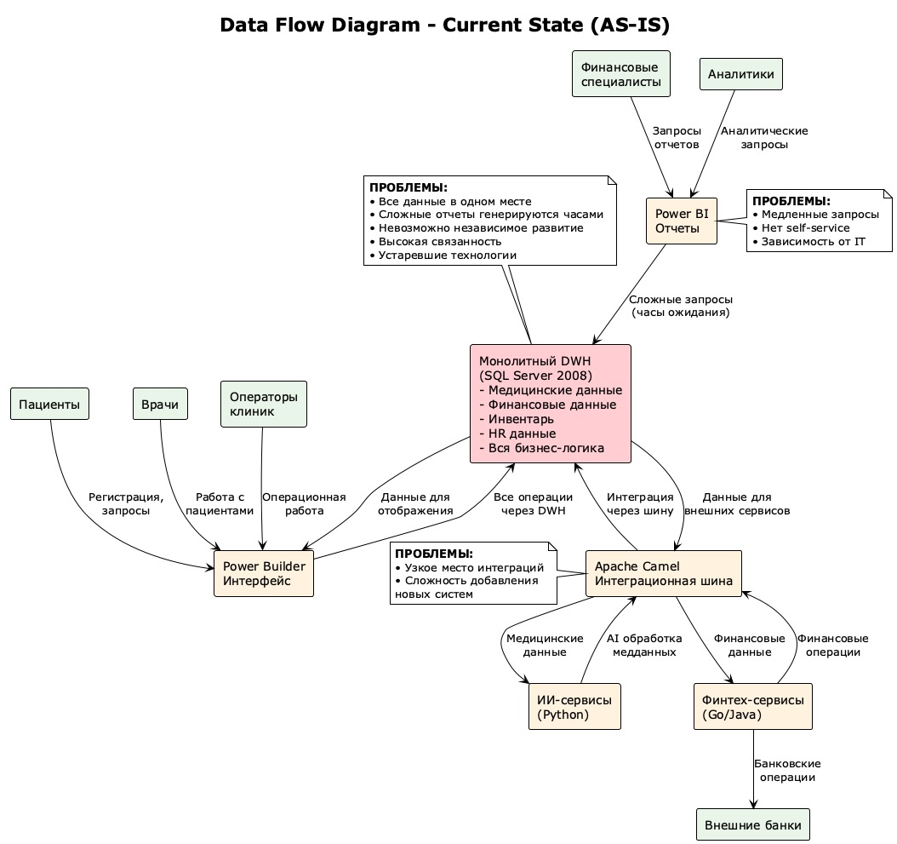
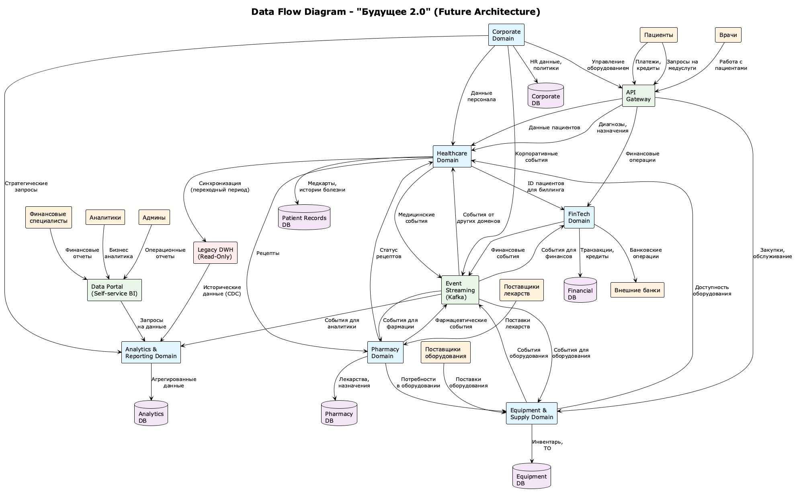

# Data Flow Diagram и доменное разделение системы "Будущее 2.0"

## Задача
Разделить систему на домены для независимого развития без необходимости реализовывать новую логику в DWH. Отразить потоки данных между доменами через Data Flow Diagram.

## Data Flow Diagrams

### Текущее состояние (AS-IS)


**Исходный код диаграммы:** [current_data_flow.puml](uml/current_data_flow.puml)

#### Проблемы текущей архитектуры:
- **Монолитный DWH** содержит всю бизнес-логику и данные всех доменов
- **Единая точка отказа** - проблемы в DWH блокируют всю систему
- **Медленные отчеты** - сложные запросы выполняются часами
- **Отсутствие изоляции** - изменения в одном домене влияют на другие
- **Узкое место интеграций** - Apache Camel не масштабируется
- **Технологический долг** - устаревшие технологии (SQL Server 2008, Power Builder)

### Целевое состояние (TO-BE)


**Исходный код диаграммы:** [data_flow_diagram.puml](uml/data_flow_diagram.puml)

#### Ключевые изменения в архитектуре:

1. **Доменное разделение**
   - 6 независимых доменов с собственными базами данных
   - Четкие границы ответственности каждого домена
   - Изолированные команды разработки

2. **Event-driven интеграция**
   - Apache Kafka для асинхронной передачи событий
   - Eventual consistency между доменами
   - Устойчивость к отказам отдельных доменов

3. **API Gateway**
   - Единая точка входа для всех клиентов
   - Маршрутизация запросов к соответствующим доменам
   - Централизованная аутентификация и авторизация

4. **Self-service BI**
   - Data Portal для самостоятельного создания отчетов
   - Агрегированные данные в Analytics Domain
   - Быстрые запросы без блокировки операционных систем

## Доменная архитектура

### Принципы выделения доменов

1. **Бизнес-ответственность** - каждый домен соответствует отдельной бизнес-области с четкими границами ответственности
2. **Автономность данных** - домены управляют своими данными независимо, минимизируя связанность
3. **Команда-владелец** - за каждый домен отвечает отдельная команда с необходимой экспертизой
4. **Независимое развитие** - домены могут развиваться с разной скоростью без блокировки друг друга
5. **Регулятивные требования** - медицинские данные изолированы согласно требованиям HIPAA/GDPR

### Выделенные домены

#### 1. Healthcare Domain
**Ответственность:** Медицинские процессы и данные пациентов

**Бизнес-функции:**
- Управление пациентами и медицинскими картами
- Ведение историй болезни и результатов исследований
- AI-диагностика и рекомендации по лечению
- Планирование и проведение медицинских процедур
- Управление медицинским персоналом

**Потоки данных:**
- ➡️ **Входящие:** Запросы пациентов и врачей через API Gateway
- ⬅️ **Исходящие:** События о пациентах в Event Bus, рецепты в Pharmacy Domain
- 💾 **Хранение:** Patient Records DB (PostgreSQL)

**Границы:**
- НЕ включает финансовые операции
- НЕ включает управление оборудованием как активами
- НЕ включает аналитику для принятия бизнес-решений

#### 2. FinTech Domain
**Ответственность:** Финансовые операции и банковские услуги

**Бизнес-функции:**
- Банковские операции и платежи
- Кредитование пациентов
- Управление финансовой историей клиентов
- Интеграция с внешними банковскими системами
- Финансовые продукты для медицинских услуг

**Потоки данных:**
- ➡️ **Входящие:** Платежи от пациентов, ID клиентов от Healthcare
- ⬅️ **Исходящие:** Финансовые события в Event Bus, операции с внешними банками
- 💾 **Хранение:** Financial DB (PostgreSQL)

**Границы:**
- НЕ включает медицинские данные пациентов
- НЕ включает операционную отчетность клиник
- Связан с Healthcare через идентификаторы клиентов

#### 3. Equipment & Supply Domain
**Ответственность:** Управление медицинским оборудованием

**Бизнес-функции:**
- Управление медицинским оборудованием
- Инвентаризация и учет активов
- Планирование закупок и поставок
- Техническое обслуживание оборудования
- Интеграция с производителями медтехники

**Потоки данных:**
- ➡️ **Входящие:** Заказы от Corporate, поставки от внешних поставщиков
- ⬅️ **Исходящие:** Доступность оборудования в Healthcare, события в Event Bus
- 💾 **Хранение:** Equipment DB (MongoDB)

**Границы:**
- НЕ включает финансовые операции по закупкам
- НЕ включает медицинские данные от оборудования
- Связан с Healthcare через использование оборудования

#### 4. Analytics & Reporting Domain
**Ответственность:** Бизнес-аналитика и отчетность

**Бизнес-функции:**
- Бизнес-аналитика и KPI
- Создание отчетов для руководства
- Прогнозирование и планирование
- Мониторинг производительности
- Self-service BI для пользователей

**Потоки данных:**
- ➡️ **Входящие:** События от всех доменов через Event Bus
- ⬅️ **Исходящие:** Отчеты и дашборды для пользователей
- 💾 **Хранение:** Analytics DB (ClickHouse)

**Границы:**
- НЕ содержит персональные медицинские данные
- НЕ включает операционные данные других доменов
- Получает данные через события от других доменов

#### 5. Pharmacy Domain
**Ответственность:** Управление лекарственными средствами

**Бизнес-функции:**
- Управление лекарственными препаратами
- Рецепты и назначения
- Склад фармацевтических товаров
- Взаимодействие с поставщиками лекарств
- Контроль качества препаратов

**Потоки данных:**
- ➡️ **Входящие:** Рецепты от Healthcare, поставки от фарм. поставщиков
- ⬅️ **Исходящие:** Статус рецептов в Healthcare, события в Event Bus
- 💾 **Хранение:** Pharmacy DB (PostgreSQL)

**Границы:**
- НЕ включает медицинские диагнозы
- НЕ включает финансовые операции
- Связан с Healthcare через рецепты

#### 6. Corporate Domain
**Ответственность:** Корпоративные функции и HR

**Бизнес-функции:**
- Управление персоналом
- Корпоративные функции и администрирование
- Управление клиниками как бизнес-единицами
- Стратегическое планирование
- Соответствие регулятивным требованиям

**Потоки данных:**
- ➡️ **Входящие:** HR процессы, стратегические запросы
- ⬅️ **Исходящие:** Данные сотрудников в другие домены, корпоративные события
- 💾 **Хранение:** Corporate DB (PostgreSQL)

**Границы:**
- НЕ включает операционные данные клиник
- НЕ включает персональные медицинские данные
- Связан со всеми доменами через сотрудников

## Аргументация доменного разделения

### Соответствие организационной структуре
Домены напрямую соотносятся с существующими подразделениями компании:
- **Healthcare** ↔ Клиники и медицинский персонал
- **FinTech** ↔ Банковское подразделение с лицензией
- **Equipment** ↔ Интеграция с производителями медтехники
- **Pharmacy** ↔ Планируемые фармацевтические компании
- **Analytics** ↔ Бизнес-аналитики и руководство
- **Corporate** ↔ Головной офис

### Обоснование границ доменов

#### Почему Healthcare отделен от FinTech?
- **Регулятивные требования**: Разные стандарты безопасности и конфиденциальности (HIPAA vs банковские требования)
- **Экспертиза команд**: Медицинская и финансовая экспертиза кардинально различаются
- **Жизненные циклы**: Медицинские процессы и банковские операции имеют разные временные рамки
- **Масштабирование**: Финтех может расти быстрее медицинского направления

#### Почему выделен Equipment Domain?
- **Сложность управления**: Медтехника требует специализированного управления активами
- **Интеграция с производителями**: Отдельные API и протоколы для медоборудования
- **Жизненный цикл активов**: Кардинально отличается от медицинских процессов
- **Планирование расширения**: Интеграция новых производителей оборудования

#### Почему Analytics выделен отдельно?
- **Cross-domain аналитика**: Агрегирует данные из всех доменов
- **Различные потребители**: Руководство, аналитики, врачи имеют разные потребности
- **Технологический стек**: BI и ML инструменты отличаются от операционных систем
- **Скорость развития**: Аналитические потребности меняются быстрее операционных

### Технологическая оптимизация по доменам

```
До: Изменение → DWH → Риск для всех функций
После: Изменение → Конкретный домен → Изоляция рисков
```

**Выбор технологий под задачи:**
- **Healthcare:** PostgreSQL для ACID транзакций с медданными
- **FinTech:** PostgreSQL для финансовых транзакций
- **Equipment:** MongoDB для гибких схем оборудования
- **Analytics:** ClickHouse для быстрой аналитики
- **Pharmacy:** PostgreSQL для нормализованных данных лекарств

## Преимущества для компании

### 1. Стратегические преимущества

#### Быстрая интеграция приобретений
- **Фармкомпании:** Легко интегрируются в Pharmacy Domain
- **Производители медтехники:** Простая интеграция в Equipment Domain
- **Новые клиники:** Подключение к Healthcare Domain без изменений других

#### Масштабирование бизнеса
- Независимое развитие направлений
- Возможность выделения доменов в отдельные компании
- Простота международной экспансии
- Различные скорости развития доменов

### 2. Технические преимущества

#### Независимое развитие
- **Отдельные команды** могут работать параллельно без конфликтов кода
- **Разные технологические стеки** для оптимального решения задач домена
- **Независимые релизы** без риска сломать другие домены
- **Горизонтальное масштабирование** каждого домена по потребности

#### Устойчивость системы
- **Изоляция отказов** - проблемы в одном домене не влияют на другие
- **Упрощенное тестирование** - меньше зависимостей для покрытия
- **Безопасность** - компрометация одного домена не затрагивает другие
- **Легкость мониторинга** - четкие границы для отслеживания производительности

### 3. Операционные преимущества

#### Производительность
```
Текущее состояние: Отчеты генерируются часами
Целевое состояние: Отчеты готовы за секунды
```

#### Self-service BI
- 80% запросов на отчеты решаются самостоятельно
- Снижение нагрузки на IT на 60%
- Ускорение принятия бизнес-решений

#### Надежность
- Доступность 99.9% вместо текущих 95%
- Изоляция отказов
- Независимые планы восстановления

### 4. Регулятивное соответствие

#### Изоляция медицинских данных
- **HIPAA/GDPR compliance:** Медданные изолированы в Healthcare Domain
- **Банковские требования:** Финансовые данные отделены от медицинских
- **Аудит:** Четкие границы для проверки соответствия

#### Контроль доступа
- Врачи не имеют доступа к финансовым данным
- Финансисты не видят медицинские карты
- Аналитики получают только агрегированные данные

### 5. Экономические преимущества

#### Снижение затрат
- **Оптимизация ресурсов:** Селективное масштабирование - ресурсы только там, где нужно
- **Специализация команд:** Более эффективная разработка - специализированные эксперты эффективнее универсалов
- **Снижение рисков:** Меньше критических инцидентов

#### Увеличение доходов
- **Быстрый time-to-market:** Новые функции запускаются быстрее
- **Лучший UX:** Self-service BI повышает удовлетворенность клиентов
- **Новые возможности:** API позволяют создавать новые продукты
- **Конкурентные преимущества** через быструю адаптацию к рынку

### 6. Организационные преимущества

#### Управление командами
- **Четкая ответственность** каждой команды за свой домен
- **Специализация** - команды развивают экспертизу в своей области
- **Автономность** - меньше координации между командами
- **Производительность** - команды могут работать в своем темпе

#### Управление рисками
- **Изоляция изменений** - снижение риска регрессий
- **Постепенная миграция** от монолита по доменам
- **Backup планы** - возможность откатить изменения в одном домене
- **Знания** - потеря экспертизы в одном домене не критична

## Архитектурные решения

### Event-Driven Architecture
```
Домен A → Событие → Kafka → Домен B
```
- Асинхронная интеграция между доменами
- Eventual consistency
- Устойчивость к отказам

### API Gateway Pattern
- Единая точка входа для всех клиентов
- Маршрутизация к соответствующим доменам
- Централизованная аутентификация

### Database per Service
- Каждый домен управляет своими данными
- Технологический выбор под задачи домена
- Изоляция схемы и эволюции данных

## Потенциальные вызовы и решения

### Вызов: Консистентность данных
**Решение:** Event-driven архитектура с eventual consistency

### Вызов: Cross-domain транзакции  
**Решение:** Saga pattern для распределенных транзакций

### Вызов: Дублирование данных
**Решение:** Принятие дублирования как цены за автономность доменов

### Вызов: Сложность интеграций
**Решение:** API Gateway и стандартизированные контракты между доменами

## План перехода

### Этап 1: Event Streaming (месяцы 1-2)
- Развертывание Apache Kafka
- Настройка CDC из текущего DWH
- Создание базовых топиков для доменов

### Этап 2: Analytics Domain (месяцы 2-4)
- Развертывание ClickHouse
- Миграция отчетности из Power BI
- Создание Data Portal

### Этап 3: Операционные домены (месяцы 4-8)
- Последовательная миграция Healthcare, FinTech, Equipment, Pharmacy
- Создание доменных API
- Интеграция через события

### Этап 4: Финализация (месяцы 8-12)
- Перевод DWH в read-only режим
- Обучение пользователей
- Оптимизация производительности

## Критерии успеха

### Технические метрики
- Время отклика API < 200ms
- Время генерации отчетов < 30 секунд
- Доступность системы > 99.9%

### Бизнес-метрики
- Self-service покрывает 80% запросов на отчеты
- Время интеграции нового домена < 2 недель
- Снижение операционных затрат на 40%

### Пользовательские метрики
- Удовлетворенность пользователей > 4.5/5
- Время обучения новых пользователей < 2 часов
- Количество инцидентов снижено на 70% 