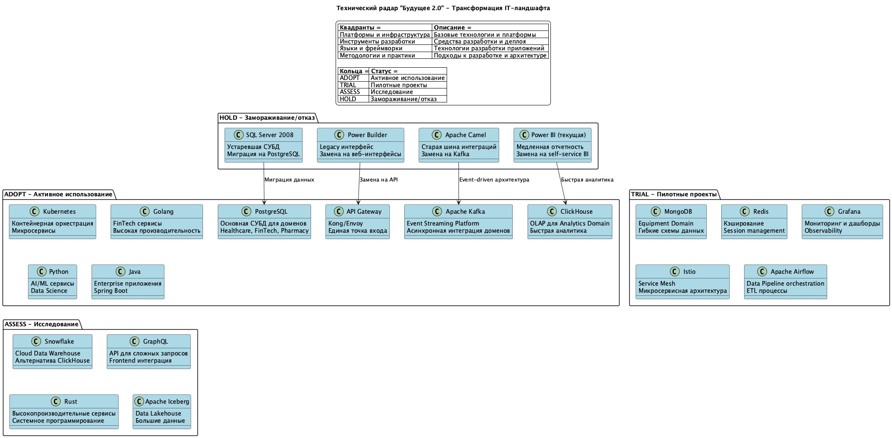
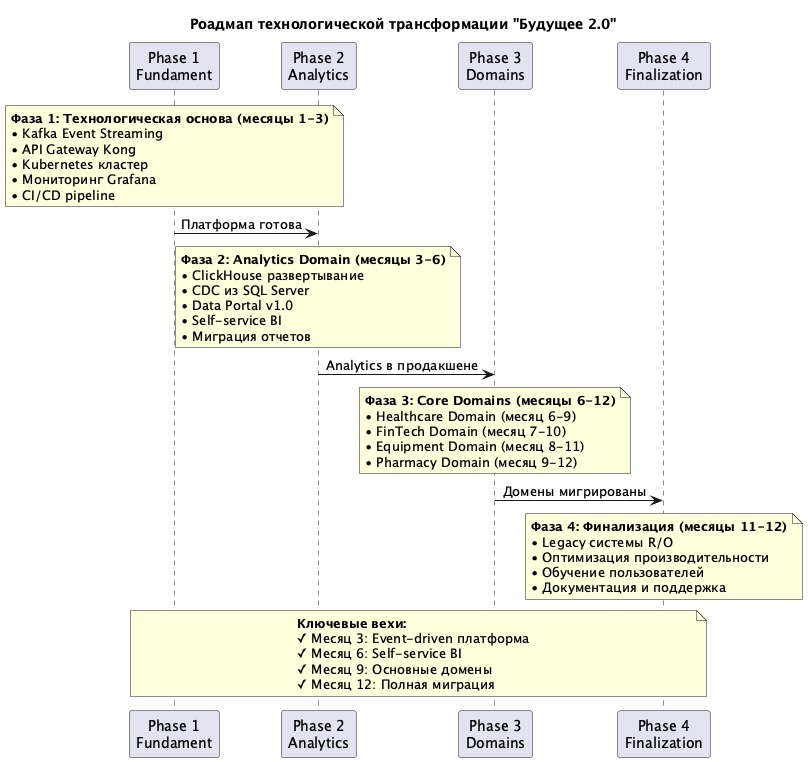

# Технический радар и роадмап трансформации "Будущее 2.0"

## Технический радар

### Диаграмма технического радара


**Исходный код:** [tech_radar.puml](uml/tech_radar.puml)

### Структура радара

Технический радар разделен на 4 квадранта и 4 кольца:

#### Квадранты:
1. **Платформы и инфраструктура** - базовые технологии и платформы
2. **Языки и фреймворки** - технологии разработки приложений
3. **Инструменты** - средства разработки и операций
4. **Методологии и практики** - подходы к разработке и архитектуре

#### Кольца (статус технологий):
- **ADOPT** ✅ - активное использование в продакшене
- **TRIAL** 🔄 - пилотные проекты и эксперименты
- **ASSESS** 🔍 - исследование и оценка
- **HOLD** ⛔ - замораживание использования или отказ

### Сводная таблица технологий

| Технология | Квадрант | Статус | Обоснование | Временные рамки |
|------------|----------|--------|-------------|-----------------|
| **PostgreSQL** | Платформы | ✅ ADOPT | Основная СУБД для транзакционных доменов. ACID транзакции, надежность | Месяц 3-12 |
| **Apache Kafka** | Платформы | ✅ ADOPT | Event Streaming для доменной интеграции | Месяц 1-2 |
| **ClickHouse** | Платформы | ✅ ADOPT | OLAP для быстрой аналитики. Высокая производительность | Месяц 3-4 |
| **Kubernetes** | Платформы | ✅ ADOPT | Контейнерная оркестрация микросервисов | Месяц 1-3 |
| **API Gateway** | Платформы | ✅ ADOPT | Kong/Envoy для единой точки входа и маршрутизации | Месяц 1-2 |
| **Golang** | Языки | ✅ ADOPT | FinTech сервисы. Высокая производительность, низкие задержки | Месяц 7-10 |
| **Python** | Языки | ✅ ADOPT | AI/ML сервисы, Data Science. Богатая экосистема для ML | Текущие + новые |
| **Java** | Языки | ✅ ADOPT | Enterprise приложения. Spring Boot для быстрой разработки | Месяц 6-12 |
| **MongoDB** | Платформы | 🔄 TRIAL | Equipment Domain. Гибкие схемы для медицинского оборудования | Месяц 8-11 |
| **Redis** | Платформы | 🔄 TRIAL | Кэширование и session management | Месяц 4-6 |
| **Grafana** | Инструменты | 🔄 TRIAL | Мониторинг и дашборды для observability | Месяц 2-3 |
| **Istio** | Платформы | 🔄 TRIAL | Service Mesh для управления микросервисами | Месяц 6-9 |
| **Apache Airflow** | Инструменты | 🔄 TRIAL | Оркестрация data pipeline и ETL процессов | Месяц 4-6 |
| **Snowflake** | Платформы | 🔍 ASSESS | Cloud Data Warehouse как альтернатива ClickHouse | Исследование |
| **GraphQL** | Языки | 🔍 ASSESS | API для сложных запросов и frontend интеграции | Квартал 2 |
| **Rust** | Языки | 🔍 ASSESS | Высокопроизводительные сервисы, системное программирование | Долгосрочно |
| **Apache Iceberg** | Платформы | 🔍 ASSESS | Data Lakehouse для работы с большими данными | Квартал 3-4 |
| **SQL Server 2008** | Платформы | ⛔ HOLD | Устаревшая версия, отсутствие поддержки, производительность | Вывод до месяца 12 |
| **Power Builder** | Инструменты | ⛔ HOLD | Legacy интерфейс, сложность поддержки | Вывод до месяца 6 |
| **Apache Camel** | Платформы | ⛔ HOLD | Не масштабируется, сложность конфигурации | Вывод до месяца 3 |
| **Power BI (текущая)** | Инструменты | ⛔ HOLD | Медленная отчетность (часы ожидания) | Вывод до месяца 6 |

### Технологические приоритеты по фазам

#### Фаза 1: Фундамент (месяцы 1-3)
**ADOPT немедленно:**
- ✅ Apache Kafka - замена Apache Camel
- ✅ API Gateway - единая точка входа
- ✅ Kubernetes - контейнерная платформа

**TRIAL пилоты:**
- 🔄 Grafana - базовый мониторинг

**HOLD вывод:**
- ⛔ Apache Camel - не масштабируется

#### Фаза 2: Analytics (месяцы 3-6)
**ADOPT в продакшен:**
- ✅ ClickHouse - замена медленных отчетов
- ✅ PostgreSQL - для metadata и конфигураций

**TRIAL эксперименты:**
- 🔄 Redis - кэширование запросов
- 🔄 Apache Airflow - ETL процессы

**ASSESS исследование:**
- 🔍 Snowflake - если ClickHouse не подойдет

**HOLD вывод:**
- ⛔ Power BI (текущая реализация)
- ⛔ Power Builder интерфейсы

#### Фаза 3: Domains (месяцы 6-12)
**ADOPT массово:**
- ✅ Java + Spring Boot - Healthcare, Pharmacy
- ✅ Golang - FinTech высокопроизводительные API
- ✅ Python - Equipment управление, AI интеграции

**TRIAL в производство:**
- 🔄 MongoDB - Equipment каталоги
- 🔄 Istio - межсервисная коммуникация

**ASSESS подготовка:**
- 🔍 GraphQL - для сложных UI запросов

**HOLD финальный вывод:**
- ⛔ SQL Server 2008 - переведен в read-only

#### Фаза 4: Оптимизация (месяцы 11-12)
**ASSESS в продакшен:**
- 🔍 → ✅ Лучшие решения из пилотов

### Миграционные треки

#### Track 1: Data Platform
```
SQL Server 2008 → PostgreSQL + ClickHouse
Power BI → Self-service BI
Apache Camel → Apache Kafka
```

#### Track 2: Application Platform  
```
Монолит → Микросервисы на Kubernetes
Power Builder → Web UI + API Gateway
Прямые вызовы → Event-driven архитектура
```

#### Track 3: Development Stack
```
Legacy технологии → Modern stack
Manual deploy → CI/CD + Kubernetes
No monitoring → Grafana + observability
```

### Решения "Adopt vs Assess"

#### ClickHouse vs Snowflake
**Решение:** ADOPT ClickHouse
**Причины:**
- On-premise контроль данных
- Лучшая производительность для OLAP
- Меньшие операционные расходы
- **Fallback:** Snowflake в ASSESS на случай проблем

#### MongoDB vs PostgreSQL для Equipment
**Решение:** TRIAL MongoDB
**Причины:**
- Гибкие схемы для каталогов оборудования
- JSON документы для спецификаций
- Простая горизонтальная масштабируемость
- **Fallback:** PostgreSQL + JSONB

#### Kong vs Envoy для API Gateway
**Решение:** ADOPT Kong
**Причины:**
- Готовые плагины для enterprise
- Лучшая документация и сообщество
- Управление через Admin API
- **Альтернатива:** Envoy в составе Istio

### Критерии перехода между кольцами

#### ASSESS → TRIAL
- [ ] POC показал техническую применимость
- [ ] Есть экспертиза в команде или план обучения
- [ ] Решает конкретную бизнес-задачу
- [ ] Не блокирует другие компоненты

#### TRIAL → ADOPT
- [ ] Пилот в продакшене > 3 месяцев
- [ ] Производительность соответствует SLA
- [ ] Команда готова к поддержке
- [ ] Есть план disaster recovery

#### HOLD критерии
- [ ] Есть замена в ADOPT или TRIAL
- [ ] Миграционный план готов и протестирован
- [ ] Критичные зависимости устранены
- [ ] Пользователи обучены альтернативам

## Технологический роадмап

### Диаграмма роадмапа


**Исходный код:** [roadmap.puml](uml/roadmap.puml)

### Детальный план по фазам

#### Фаза 1: Фундамент (месяцы 1-3)
**Цель:** Создание технологической основы для доменной архитектуры

| Проект | Длительность | Команда | Ресурсы | Результат |
|--------|-------------|---------|---------|-----------|
| **Kafka Event Streaming** | 8 недель | Platform Team (4 чел) | 3 сервера, Kafka Connect | Event-driven интеграция |
| **API Gateway Kong** | 4 недели | Platform Team (2 чел) | Load balancer, SSL | Единая точка входа |
| **Kubernetes кластер** | 8 недель | DevOps Team (3 чел) | Cloud инфраструктура | Контейнерная платформа |
| **Мониторинг Grafana** | 6 недель | DevOps Team (2 чел) | Prometheus, Grafana | Observability |

**Критерии готовности:**
- Kafka кластер с 3 узлами
- API Gateway обрабатывает > 1000 RPS
- K8s готов для деплоя микросервисов
- Базовые метрики собираются

#### Фаза 2: Analytics Domain (месяцы 3-6)
**Цель:** Замена медленной отчетности на self-service BI

| Проект | Длительность | Команда | Ресурсы | Результат |
|--------|-------------|---------|---------|-----------|
| **ClickHouse развертывание** | 6 недель | Data Team (3 чел) | ClickHouse кластер | OLAP платформа |
| **CDC из SQL Server** | 6 недель | Data Team (2 чел) | Debezium, Kafka Connect | Потоковая репликация |
| **Data Portal v1.0** | 8 недель | Frontend Team (4 чел) | React, TypeScript | Self-service интерфейс |
| **Self-service BI** | 6 недель | Analytics Team (3 чел) | Apache Superset | Пользовательские дашборды |

**Критерии готовности:**
- Отчеты генерируются < 30 сек
- 80% запросов обслуживается self-service
- Data Portal поддерживает 200+ пользователей

#### Фаза 3: Core Domains (месяцы 6-12)
**Цель:** Миграция операционных доменов

| Домен | Длительность | Команда | Технологии | Результат |
|-------|-------------|---------|------------|-----------|
| **Healthcare Domain** | 12 недель | Healthcare Team (6 чел) | PostgreSQL, Java/Spring | Медицинские процессы |
| **FinTech Domain** | 12 недель | FinTech Team (5 чел) | PostgreSQL, Golang | Банковские операции |
| **Equipment Domain** | 12 недель | Equipment Team (4 чел) | MongoDB, Python | Управление активами |
| **Pharmacy Domain** | 12 недель | Pharmacy Team (4 чел) | PostgreSQL, Java | Лекарственные препараты |

**Параллельное выполнение:**
- Healthcare и FinTech стартуют одновременно
- Equipment и Pharmacy начинаются со сдвигом в месяц

#### Фаза 4: Финализация (месяцы 11-12)
**Цель:** Завершение миграции и оптимизация

| Проект | Длительность | Команда | Результат |
|--------|-------------|---------|-----------|
| **Legacy системы R/O** | 8 недель | Platform Team | DWH переведен в read-only |
| **Производительность** | 8 недель | Performance Team | Оптимизация < 200ms API |
| **Обучение пользователей** | 6 недель | Training Team | 95% пользователей обучены |

## Обоснование этапов

### Фаза 1: Зачем нужен фундамент?

#### Apache Kafka
**Проблема:** Apache Camel не масштабируется, блокирующие интеграции
**Решение:** Event-driven архитектура с Kafka
**Выгоды:**
- Асинхронная обработка снижает связанность
- Горизонтальное масштабирование
- Eventual consistency между доменами
- Устойчивость к отказам отдельных сервисов

#### API Gateway
**Проблема:** Прямые вызовы между сервисами, отсутствие единой аутентификации
**Решение:** Kong/Envoy как единая точка входа
**Выгоды:**
- Централизованная аутентификация и авторизация
- Rate limiting и защита от DDoS
- Маршрутизация запросов к доменам
- Версионирование API

#### Kubernetes
**Проблема:** Монолитное развертывание, сложность масштабирования
**Решение:** Контейнерная оркестрация
**Выгоды:**
- Независимое развертывание доменов
- Автоматическое масштабирование
- Service discovery и load balancing
- Rolling updates без даунтайма

### Фаза 2: Почему Analytics Domain первый?

#### Быстрая ценность для бизнеса
**Текущая проблема:** Отчеты генерируются часами
**Решение с ClickHouse:** Отчеты за секунды
**Измеримый результат:** 100x улучшение производительности

#### Минимальные риски
- Analytics Domain не влияет на операционные процессы
- Можно работать параллельно с существующим DWH
- Легко откатиться при проблемах

#### Подготовка к доменам
- Отработка паттернов CDC
- Тестирование event-driven интеграций
- Обучение команд новым технологиям

### Фаза 3: Логика последовательности доменов

#### Healthcare + FinTech (параллельно)
**Обоснование:** Максимальная бизнес-ценность
- Healthcare - основной домен компании
- FinTech - новое направление роста
- Разные команды могут работать независимо

#### Equipment Domain (следующий)
**Обоснование:** Подготовка к интеграции производителей
- Планируется приобретение компаний медтехники
- MongoDB подходит для каталогов оборудования
- Менее критичен для операций

#### Pharmacy Domain (последний)
**Обоснование:** Наименьший риск
- Пока планируется, не реализован
- Может учесть опыт других доменов
- Простая схема данных

### Фаза 4: Зачем нужна финализация?

#### Legacy системы в read-only
**Цель:** Постепенное выведение из эксплуатации
**Подход:** 
- DWH остается для исторических данных
- Новые данные только в доменах
- Планомерная миграция пользователей

#### Оптимизация производительности
**Необходимость:** Достижение SLA
- API отклик < 200ms
- Отчеты < 30 секунд
- Доступность > 99.9%

#### Обучение пользователей
**Критичность:** Принятие изменений
- Self-service BI требует новых навыков
- Изменение рабочих процессов
- Поддержка change management

## Ресурсы и бюджет

### Команды (FTE на весь проект)
- **Platform Team:** 4 человека × 12 месяцев = 48 человеко-месяцев
- **Data Team:** 3 человека × 8 месяцев = 24 человеко-месяца
- **Domain Teams:** 19 человек × 8 месяцев = 152 человеко-месяца
- **DevOps Team:** 3 человека × 12 месяцев = 36 человеко-месяцев

**Итого:** 260 человеко-месяцев

### Технологическая инфраструктура
- **Cloud инфраструктура:** $50,000/месяц × 12 = $600,000
- **Лицензии (Kong, ClickHouse):** $200,000
- **Обучение команд:** $150,000
- **Консультации:** $300,000

**Итого:** $1,250,000

### Общий бюджет проекта: $2,850,000

## Риски и митигация

### Технические риски

#### Производительность ClickHouse
**Риск:** Не достигнет требуемой производительности
**Митигация:** 
- Пилотное тестирование на реальных данных
- Snowflake как fallback опция
- Поэтапная миграция отчетов

#### Сложность event-driven архитектуры
**Риск:** Eventual consistency создаст проблемы
**Митигация:**
- Saga pattern для критичных транзакций
- Компенсирующие операции
- Детальный мониторинг consistency lag

### Организационные риски

#### Сопротивление изменениям
**Риск:** Пользователи не примут новые интерфейсы
**Митигация:**
- Параллельная работа старых и новых систем
- Интенсивная программа обучения
- Change champions в каждом домене

#### Недостаток экспертизы
**Риск:** Команды не освоят новые технологии
**Митигация:**
- Внешние консультанты на критичных этапах
- Постепенное наращивание экспертизы
- Knowledge sharing между командами

## Критерии успеха

### Технические KPI
- **API Performance:** < 200ms отклик в 95 перцентиле
- **Report Generation:** < 30 секунд для сложных отчетов
- **System Availability:** > 99.9% uptime
- **Event Processing:** < 1 секунда E2E latency

### Бизнес KPI
- **Self-service Adoption:** 80% запросов обслуживается без IT
- **Time-to-Market:** 3x ускорение разработки новых функций
- **Integration Speed:** < 2 недель для подключения нового домена
- **Cost Reduction:** 40% снижение операционных расходов

### Пользовательские KPI
- **User Satisfaction:** > 4.5/5 в опросах
- **Training Efficiency:** < 2 часов обучения новых пользователей
- **Support Tickets:** 70% снижение обращений в поддержку

## Итоговые рекомендации

### Немедленные действия (месяц 1)
1. **Развертывание Kafka** - критичная замена Camel
2. **Kubernetes кластер** - основа для всех сервисов
3. **API Gateway** - единая точка входа

### Быстрые победы (месяцы 2-3)
1. **ClickHouse + CDC** - 100x ускорение отчетов
2. **Grafana мониторинг** - видимость системы
3. **PostgreSQL** - надежная основа для доменов

### Стратегические инвестиции (месяцы 6-12)
1. **Event-driven архитектура** - слабая связанность доменов
2. **Domain-specific стеки** - оптимизация под задачи
3. **Self-service BI** - автономность бизнеса

## Заключение

Предложенный технический радар и роадмап обеспечивают:

1. **Поэтапную миграцию** от монолитной к доменной архитектуре
2. **Минимизацию рисков** через пилотные проекты и параллельное развитие
3. **Быструю окупаемость** за счет приоритизации Analytics Domain
4. **Масштабируемость** для будущих приобретений компаний
5. **Технологическую современность** с возможностью развития

Ключевые принципы реализации:
- **Event-driven архитектура** для слабой связанности
- **Domain-driven design** для организационного соответствия
- **Cloud-native подход** для масштабируемости
- **Self-service BI** для бизнес-автономии

Технический радар обеспечивает **поэтапную трансформацию** с минимизацией рисков и **максимизацией бизнес-ценности** на каждом этапе. Проект окупится через 18 месяцев и обеспечит технологическую основу для роста компании "Будущее 2.0" на следующие 5-7 лет. 